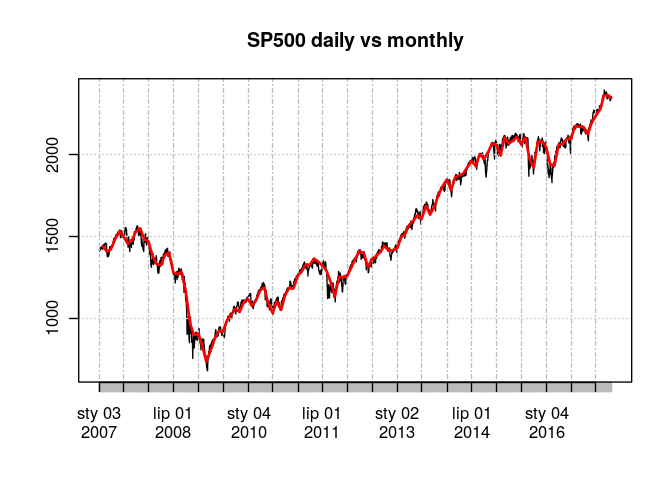

xts - wprowadzenie:
-------------------

`xts` jest pakietem udostępniającym bardzo wygodną klasę (o nazwie
`xts`!) reprezentującą szereg czasowy:

    library(xts)

    # Ukgas - przykładowe dane
    # o klasie `ts`
    class(UKgas)

    ## [1] "ts"

    # xts pozwala na łatwą konwersję wielu klas na typ xts
    # przy pomocy as.xts:
    ukgas <- as.xts(UKgas)

    class(ukgas)

    ## [1] "xts" "zoo"

Jedną z głównych zalet `xts` jest możliwość bardzo łatwego wybierania
określonego zakresu dat:

    ## Pobieranie danych:
    ukgas["1985"] # wybrany rok

    ##           [,1]
    ## 1985 Q1 1087.0
    ## 1985 Q2  534.7
    ## 1985 Q3  281.8
    ## 1985 Q4  787.6

    ukgas["1984/1985"] # zakres dat

    ##           [,1]
    ## 1984 Q1  989.4
    ## 1984 Q2  477.1
    ## 1984 Q3  233.7
    ## 1984 Q4  730.0
    ## 1985 Q1 1087.0
    ## 1985 Q2  534.7
    ## 1985 Q3  281.8
    ## 1985 Q4  787.6

    ukgas["1984/"] # po dacie

    ##           [,1]
    ## 1984 Q1  989.4
    ## 1984 Q2  477.1
    ## 1984 Q3  233.7
    ## 1984 Q4  730.0
    ## 1985 Q1 1087.0
    ## 1985 Q2  534.7
    ## 1985 Q3  281.8
    ## 1985 Q4  787.6
    ## 1986 Q1 1163.9
    ## 1986 Q2  613.1
    ##  [ reached getOption("max.print") -- omitted 2 rows ]

    ukgas["/1961"] # do daty

    ##          [,1]
    ## 1960 Q1 160.1
    ## 1960 Q2 129.7
    ## 1960 Q3  84.8
    ## 1960 Q4 120.1
    ## 1961 Q1 160.1
    ## 1961 Q2 124.9
    ## 1961 Q3  84.8
    ## 1961 Q4 116.9

    gas <- ukgas["1984/1985"]

rollapply
---------

`rollapply` powala na bardzo proste wywołanie wybranej funkcji dla
określonego okna:

    rollapply(1:5, width = 3, align = "center", sum)

    ## [1]  6  9 12

W przypadku obiektu `xts` należy wybrać sposób wyrównania danych:

-   `center` - wynik zostanie zwrócony z datą środku przedziału.
-   `left` - wynik zostanie zwrócony z datą początku przedziału.
-   `right` - wynik zostanie zwrócony z datą końca przedziału.

<!-- -->

    rollapply(gas, width = 3, align = "center", sum)

    ##           [,1]
    ## 1984 Q1     NA
    ## 1984 Q2 1700.2
    ## 1984 Q3 1440.8
    ## 1984 Q4 2050.7
    ## 1985 Q1 2351.7
    ## 1985 Q2 1903.5
    ## 1985 Q3 1604.1
    ## 1985 Q4     NA

    rollapply(gas, width = 3, align = "left", sum)

    ##           [,1]
    ## 1984 Q1 1700.2
    ## 1984 Q2 1440.8
    ## 1984 Q3 2050.7
    ## 1984 Q4 2351.7
    ## 1985 Q1 1903.5
    ## 1985 Q2 1604.1
    ## 1985 Q3     NA
    ## 1985 Q4     NA

    rollapply(gas, width = 3, align = "right", sum)

    ##           [,1]
    ## 1984 Q1     NA
    ## 1984 Q2     NA
    ## 1984 Q3 1700.2
    ## 1984 Q4 1440.8
    ## 1985 Q1 2050.7
    ## 1985 Q2 2351.7
    ## 1985 Q3 1903.5
    ## 1985 Q4 1604.1

#### Nawiasem - `rollapplyr`

Z racji, że bardzo często wykorzystywaną wersją `rollapply` jest wersja
w której `align = "right"`, została zdefiniowana funkcja `rollapplyr`.
Została ona zdefiniowana jako prosty wrapper:

    rollapplyr

    ## function (..., align = "right") 
    ## {
    ##     rollapply(..., align = align)
    ## }
    ## <environment: namespace:zoo>

xta apply
---------

`xts` udostępnia kilka funkcji postaci `apply.*`, gdzie `*` oznacza
wybrany przedział czasowy. Poniżej przykład w którym funkcja sum zostaje
wywołana z osobna dla każdego roku:

    ukgas <- as.xts(UKgas)
    apply.yearly(ukgas, sum)

    ##           [,1]
    ## 1960 Q4  494.7
    ## 1961 Q4  486.7
    ## 1962 Q4  523.6
    ## 1963 Q4  544.4
    ## 1964 Q4  536.4
    ## 1965 Q4  571.6
    ## 1966 Q4  600.4
    ## 1967 Q4  634.0
    ## 1968 Q4  680.4
    ## 1969 Q4  731.6
    ##  [ reached getOption("max.print") -- omitted 17 rows ]

    apply.yearly(ukgas, mean)

    ##            [,1]
    ## 1960 Q4 123.675
    ## 1961 Q4 121.675
    ## 1962 Q4 130.900
    ## 1963 Q4 136.100
    ## 1964 Q4 134.100
    ## 1965 Q4 142.900
    ## 1966 Q4 150.100
    ## 1967 Q4 158.500
    ## 1968 Q4 170.100
    ## 1969 Q4 182.900
    ##  [ reached getOption("max.print") -- omitted 17 rows ]

Przykład - konwersja danych dziennych na miesięczne.
----------------------------------------------------

W pracy na szeregach czasowych zdarza się, że zachodzi potrzeba
konwersji danych o wyższej częstotliwości do niższej. Na przykład dane
dzienne należy zagregować do danych miesięcznych.

W poniższym przykładzie zostanie przedstawiony sposób takiej
transformacji z wykorzystaniem pakietu `apply.monthly`.

Pobieranie danych:

    # Pakiet quantmod pozwala na łatwe
    # pobieranie danych finansowych z internetu 
    pacman::p_load(quantmod)
    data <- getSymbols("^GSPC", auto.assign = FALSE)

    class(data) # getSymbols od razu pobiera xts!

    ## [1] "xts" "zoo"

    # Wybranie kolumn OHLC i zmiana nazw kolumn
    data <- data[,c(1,2,3,4)] 
    colnames(data) <- c("Open", "High", "Low", "Close")

Po pobraniu danych należy skonstruować funkcję która będzie konwertować
dane dzienne do miesięcznych w formacie OHLC (Open, High, Low, Close), z
wykorzystaniem funkcji `apply.monthly`:

    # Przygotowanie funkcji dla apply.monthly.
    # Najlepiej zacząć pracę od próby funkcji na całych danych:
    x <- data
    x[1,1]

    ##               Open
    ## 2007-01-03 1418.03

    max(x)

    ## [1] 2400.98

    min(x)

    ## [1] 666.79

    x[nrow(x), ncol(x)]

    ##              Close
    ## 2017-04-21 2348.69

    # x[1,1] i x[nrow(x), ncol(x)] zwracają obiekty 
    # xts których nie da się łatwo połączyć z zwykłymi liczbami 
    # zwracanymi przez min i max
    # Nie działa!
    # c(
    #   x[1,1],
    #   max(x),
    #   min(x),
    #   x[nrow(x), ncol(x)])

    # Najprostszym sposobem jest konwersja xts na macierz
    # - wtedy wszystko działa bez problemu:
    x <- as.matrix(x)
    c(
      Open = x[1,1],
      High = max(x),
      Low  = min(x),
      Close = x[nrow(x), ncol(x)])

    ##    Open    High     Low   Close 
    ## 1418.03 2400.98  666.79 2348.69

    # Ostatecznie opakowując w funckję otrzymuje się:
    singleOHLC <- function(x) {
      x <- as.matrix(x)
      c(
        Open = x[1,1],
        High = max(x),
        Low  = min(x),
        Close = x[nrow(x), ncol(x)])
    }

    # Wywołanie dla całych danych:
    singleOHLC(data)

    ##    Open    High     Low   Close 
    ## 1418.03 2400.98  666.79 2348.69

    # Wykrzystując funckję singleOHLC otrzymuje się
    # dane o szukanej rozdzielczości:
    monthly <- apply.monthly(data, singleOHLC)
    monthly

    ##               Open    High     Low   Close
    ## 2007-01-31 1418.03 1441.61 1403.97 1438.24
    ## 2007-02-28 1437.90 1461.57 1389.42 1406.82
    ##  [ reached getOption("max.print") -- omitted 122 rows ]

W pewnych przypadkach, gdy funkcja przekazywana do `apply*` jest bardzo
prosta nie ma potrzeby by nawet ją nazywać, wtedy można ją wpisać całą
jako argument tak jak w poniższym przykładzie:

    # Nie ma problemu by zbudować szereg roczny:
    apply.yearly(data, singleOHLC)

    ##               Open    High     Low   Close
    ## 2007-12-31 1418.03 1576.09 1363.98 1468.36
    ## 2008-12-31 1467.97 1471.77  741.02  903.25
    ##  [ reached getOption("max.print") -- omitted 9 rows ]

    data.monthly <- apply.monthly(data, function(x) {
      x <- as.matrix(x)
      c(Open = x[1,1], High = max(x), Low = min(x), Close = x[nrow(x), ncol(x)])
    })

Na koniec można narysować wykres przedstawiający porównanie cen
zamknięcia dziennych i miesięcznych na jednym wykresie:

    plot(data[, "Close"], main = "SP500 daily vs monthly")
    lines(data.monthly[, "Close"], col = "red", lwd = 2)

