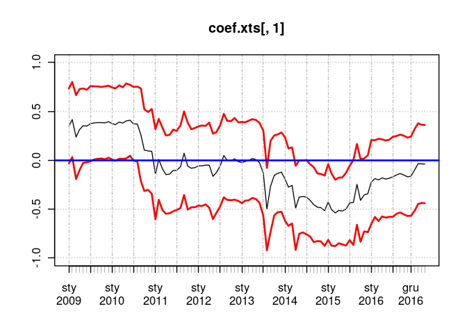

Pobranie danych do przykładu:
-----------------------------

Na początek pobranie i przekształcenie danych z wykorzystaniem kodu z
poprzedniej części:

    # wczytanie potrzebnych pakietów:
    # lubridate przyda się później:
    pacman::p_load(quantmod, xts, lubridate)
    data <- getSymbols("^GSPC", auto.assign = FALSE)
    class(data) # getSymbols od razu pobiera xts

    ## [1] "xts" "zoo"

    # Wybranie kolumn OHLC i zmiana nazw kolumn
    data <- data[,c(1,2,3,4)] 
    colnames(data) <- c("Open", "High", "Low", "Close")

    # Konwersja danych dziennych na miesieczne:
    data.monthly <- apply.monthly(data, function(x) {
      x <- as.matrix(x)
      c(Open = x[1,1], High = max(x), Low = min(x), Close = x[nrow(x), ncol(x)])
    })

    # Pobranie tylko danych close
    # i obliczenie zwrotów logarytmicznych
    close <- data.monthly[, "Close"]
    close <- na.omit(diff(log(close)))

Cel! Budowa modelu ar dla każdego okna o długości `n`
-----------------------------------------------------

Najpierw przygotowanie funkcji do budowy modelu:

    # Budowa na całych danych:
    fit <- arima(close, order = c(1,0,0))
    fit # Dopasowany model

    ## 
    ## Call:
    ## arima(x = close, order = c(1, 0, 0))
    ## 
    ## Coefficients:
    ##          ar1  intercept
    ##       0.1732     0.0041
    ## s.e.  0.0885     0.0047
    ## 
    ## sigma^2 estimated as 0.001889:  log likelihood = 211.16,  aic = -416.32

    # Funkcja do zastosowania w rollapply: 
    fitModel <- function(x) {
      arima(x, c(1,0,0))
    }

    # Nie dziala!!!
    # rollapply(close, align = "right", width = 24, fitModel)

Niestety wywołanie
`rollapply(close, align = "right", width = 24, fitModel)` nie zadziała.
`rollapply` działa dobrze w przypadku, gdy wynikiem przekazywanej
funkcji jest pojedyncza liczba, w innych przypadkach może być różnie - z
reguły - bez sukcesu.

Na szczęście można troszkę oszukać i wykorzystać `rollapply` jedynie do
wygodnego tworzenia okien o określonej liczbie elementów, a dopasowane
modele zapisywać w innej strukturze. Pora na środowisko.

Środowisko
----------

Środowisko jest specjalnym obiektem, którego elementy mogą być
modyfikowane wewnątrz innych funkcji.

    # Tworzenie środowiska i zapisanie do niego elementu x
    dt.env <- new.env()
    dt.env$x <- 10

    # Funckja zapisująca w swoim wnętrzy wartość do zmiennej x
    tmpFnc <- function() {
      x <- 20
    }

    # Funkcja zapisująca w swoim wnętrzu wartość do x będącego w środowisku dt.env
    envFnc <- function() {
      dt.env$x <- 20
    }

    x <- 10
    tmpFnc()
    x # x jest taki sam

    ## [1] 10

    dt.env$x

    ## [1] 10

    envFnc()
    dt.env$x # x ze środowiska dt.env został zmodyfikowany!

    ## [1] 20

Powrót do rollapply.
--------------------

By rozwiązać problem z `rollapply` można wykorzystać środowisko, do
którego będą zapisywane zbudowane modele, a sama funkcja będzie zwracać
bądź wie co, byleby `rollapply` było szczęśliwe:

    # Przygotowanie środowiska i listy w której
    # będą trzymane zbudowane modele
    result.env <- new.env()
    result.env$result.list <- list()

    fitModelEnv <- function(x) {
      
      # Zapisanie daty ostatniego elementu:
      end.date <- as.character(tail(index(x), 1))
      
      # Budowa modelu
      fit <- arima(x, c(1,0,0))
      
      # Zapisywanie modelu w liście należącej do 
      # środowiska result.env. Jako indeks 
      # wykorzystywana jest data ostatniej obserwacji z okna
      result.env$result.list[[end.date]] <- fit

      # funkcja musi coś zwracać - 1 jest ok!
      return(1)
    }

    tmp <- rollapply(close, align = "right", width = 24, fitModelEnv)

    # Pobranie listy ze środowiska:
    result.list <- result.env$result.list

    # użycie lappy do pobrania współczynnika autoregresji
    # i jego odchylenia standardowego
    coef.list <- lapply(result.list, function(x) {
      c(x$coef[[1]], sqrt(x$var.coef[[1]]))
    })

    # konwersja indeksów na datę wymaganą przez xts
    idx <- ymd(names(coef.list))

    # Sklejenie wyników z listy zawierającej 
    # współczynniki w poszczególnych oknach:
    coef.mat <- Reduce(rbind, coef.list)
    coef.xts <- xts(coef.mat, order.by = idx)
    coef.xts

    ##                     [,1]      [,2]
    ## 2009-01-30  3.518202e-01 0.1920330
    ## 2009-02-27  4.172543e-01 0.1923053
    ## 2009-03-31  2.378280e-01 0.2149451
    ## 2009-04-30  3.142200e-01 0.2074228
    ## 2009-05-29  3.536241e-01 0.1907960
    ##  [ reached getOption("max.print") -- omitted 95 rows ]

    plot(coef.xts[,1], ylim = c(-1,1))
    lines(coef.xts[,1] - 2 * coef.xts[,2], lwd = 2, col = "red")
    lines(coef.xts[,1] + 2 * coef.xts[,2], lwd = 2, col = "red")
    abline(h = 0, col = "blue", lwd = 2)

Cel numer 2! Predykcja.
-----------------------

    # Stworzenie środowiska i dwóch list
    # Pierwsza jak poprzednio służy do zapisywania modelu
    # Druga - do zapisywania prognozy, odchylenia standardowego
    # prognozy i surowej wartości
    result.env <- new.env()
    result.env$result.list <- list()
    result.env$forecast.list <- list()

    predictModelEnv <- function(x) {

      end.date <- as.character(tail(index(x), 1))
      
      # Usunięcie ostatniej obserwacji:
      xx <- head(x, -1)
      fit <- arima(xx, c(1,0,0))
      result.env$result.list[[end.date]] <- fit

      # Predykcja na jeden okres do przodu:
      forecast <- predict(fit, 1)

      result.env$forecast.list[[end.date]] <- c(
        Forecast = forecast$pred[[1]],
        SE  = forecast$se[[1]],
        Raw = as.numeric(tail(x,1)))

      return(1)
    }

    tmp <- rollapply(close, align = "right", width = 25, predictModelEnv)

    forecast.result <- Reduce(rbind, result.env$forecast.list)
    forecast.result <- xts(forecast.result, order.by = lubridate::ymd(names(result.env$forecast.list)))

    plot(forecast.result[,3], type = "p", pch = 19, main = "Forecast vs Observed")
    points(forecast.result[,1], pch = 19, col = "red")

    plot(forecast.result[,3] - forecast.result[,1], pch = 19, type = "p")
    abline(h = 0, col = "red", lty = 2)
    lines(forecast.result[,2] * 2, col = "blue")
    lines(-forecast.result[,2] * 2, col = "blue")

    rmse <- function(x) {
      sqrt(mean((x[,1] - x[,3])^2))
    }

    rmse.24 <- rmse(forecast.result)
    rmse.24

    ## [1] 0.04248254

Jeszcze mała zmiana - budowanie modelu od początku danych:

    result.env <- new.env()
    result.env$result.list <- list()
    result.env$forecast.list <- list()

    predictModelEnv <- function(x) {

      end.date <- as.character(tail(index(x), 1))
      
      # Usunięcie ostatniej obserwacji:
      xx <- head(x, -1)
      xx <- close[paste0("/", as.character(tail(index(xx), 1)))]
      
      fit <- arima(xx, c(1,0,0))
      result.env$result.list[[end.date]] <- fit

      # Predykcja na jeden okres do przodu:
      forecast <- predict(fit, 1)

      result.env$forecast.list[[end.date]] <- c(
        Forecast = forecast$pred[[1]],
        SE  = forecast$se[[1]],
        Raw = as.numeric(tail(x,1)))

      return(1)
    }

    tmp <- rollapply(close, align = "right", width = 25, predictModelEnv)

    forecast.result <- Reduce(rbind, result.env$forecast.list)
    forecast.result <- xts(forecast.result, order.by = lubridate::ymd(names(result.env$forecast.list)))

    rmse(forecast.result)

    ## [1] 0.04268152

Ostatecznie RMSE modelu estymowanego na 24 ostatnich obserwacjach
wyniosło 0.042, a w przypadku budowy modelu na całej dostępnej historii
0.043.
